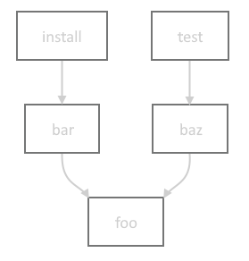

# Intermediate Zig Build System

One of the things I’ve been working on for the Orca project is a new build system leveraging the Zig toolchain. If you’re curious, I cover the topic in this post: [https://orca-app.dev/posts/250710/orca_build_system.html](https://orca-app.dev/posts/250710/orca_build_system.html). Orca’s build is not simple - it required a bunch of extra knowledge of the build system to implement that I’d like to share.

This information is up to date for Zig 0.14.x. Future versions may render this information out of date.

This post is written assuming basic knowledge of Zig’s build system. If you haven’t watched Loris’ great overview on the topic, watch this first: [https://www.youtube.com/watch?v=jy7w_7JZYyw](https://www.youtube.com/watch?v=jy7w_7JZYyw)

# Lazy Builds & Paths

To quickly review, `build.zig` contains a `pub fn build()` that generates a lazily-evaluated build graph depending on what step(s) the user selected to perform. For example, take a build graph that looks like this:

bar->foo, test->baz->foo"></img>

Running `zig build install` will only actually run the build steps for `install`, `bar`, and `foo`. The `baz` and `test` steps will be ignored. We can list all the steps with `zig build -l`:

```
> zig build -l
  install (default)            Copy build artifacts to prefix path
  uninstall                    Remove build artifacts from prefix path
  test                         Build and run all tests
```

Because `build()` only constructs the build graph, and doesn’t actually run these steps, it’s impossible for it to know for certain what the paths for all artifacts and directories paths will be. To represent these to-be-resolved paths, it uses `LazyPath`, which is a union representing a path that will be resolved at some future point by the build system. 

`LazyPath`s can be created in several ways:
* `b.path()` returns a path relative to the build root
* Manually constructed with an absolute or relative path: `LazyPath{.cwd_relative = "/usr/my/path"}`
* As a product of build steps, such as `Step.Compile.getEmittedBin()`
* From a dependency via `Dependency.path()`
* From `LazyPath.join()`, which concats a given instance with a subpath

`LazyPath` is an extremely important tool for the build system. While `Build.Step.dependOn()` is used to establish the ordering between steps, `LazyPath` is often the way data is passed between steps. When passing data to another `Build.Step`, use `LazyPath.addStepDependencies()` to ensure the proper dependencies are established between the two steps - this is much easier than setting them up manually.

# Dependencies

Distinct from build graph dependencies (`Build.Step`), package dependencies (`Build.Dependency`) represent a build-time dependency on external code/data, and are declared in `build.zig.zon`. By default, all dependencies are fetched up-front by `zig build` to ensure they’re available to the build script when it runs. However, let’s say you have a platform-specific dependency such as`dawn-windows-x64`. It would be wasteful to require fetching this for non-Windows targets. Luckily, any dependency can be marked `lazy` inside `build.zig.zon` to avoid requiring it by default:

```
.@"dawn-windows-x64" = .{
	.url = "https://github.com/orca-app/dawn/releases/download/release-8260be1/dawn-windows-x64.tar.gz",
	.hash = "N-V-__8AAFgqSwAoOlOfK8ZzIHcOlfAwAKfuQLTHGrLS7Nzj",
	.lazy = true,
},
```

This modifies usage a bit inside the build script, where you need to explicitly refer to these with `Build.lazyDependency()`, and unwrap the possibly-null value. Once it’s unwrapped, you can use the dependency as usual.

```c
if (target.result.os.tag == .windows) {
	if (b.lazyDependency("dawn-windows-x64", .{})) |dawn_dep| {
			// dawn_dep is of type Build.Dependency as usual
	}
}
```

Under the hood, after the build graph is constructed, `zig build` checks to see if there are any calls to `lazyDependency()` that require as-yet-unfetched dependencies; these would have returned `null` in the build script. If there needed dependencies, it fetches them on the spot and reruns the build script with the now-satisfied lazy dependencies. See the [source code](https://github.com/ziglang/zig/blob/d03a147ea0a590ca711b3db07106effc559b0fc6/lib/std/Build.zig#L2186-L2217) for more details.

One other cool thing about dependencies is the level of access you can get to data inside the package. Zig projects enjoy first-class support where you can get access to any public `Module`, `Step.Compile`, `WriteFile`, or even `LazyPath`. However, even if the dependency isn’t a Zig module, and is just an archive, you can still get access to any path inside the package with `Dependency.path()`. 

The combination of these two features is how Orca fetches prebuilt dependencies for the complex Angle and Dawn libraries, and seamlessly links them into the build for the particular target the user is building.

# Targets

Zig’s cross-compilation support is best-in-class, bar none. It’s very easy to build a given application with a target triple, such as `zig build -Dtarget=mips-linux-gnueabi`, even if you’re on a completely different architecture and platform. But if you wanted to be able to specify and customize build targets in the build script itself, there is an even more powerful interface for this. 

Let’s say as part of the build graph, I wanted to build a WebAssembly module with a few specific features turned on. Simply create a target query with `std.Target.Query`, adding optional CPU features via the `std.Target.<desired target>.featureSet()` function. Finally you resolve the query into a `Build.ResolvedTarget` which contains both the original query and target.

```c
const target_query: std.Target.Query = .{
	.cpu_arch = .wasm32,
	.os_tag = .freestanding,
	.cpu_features_add = std.Target.wasm.featureSet(&.{.bulk_memory, .multivalue}));
};
const target: Build.ResolvedTarget = b.resolveTargetQuery(target_query);
```

Finally, when cross-compiling for a target different than the host machine, you may want to build some modules for the host machine anyway. For example, one step of the build graph could be a helper program that embeds a bunch of shader files strings in a C header, which is then included in the build. That glue program needs to actually be run as part of the graph, and is not an artifact intended to be part of the cross-compile output. It needs to be compiled for the host target, not the target the user is specifying. You retrieve the host machine target via `b.graph.host`, which contains the `ResolvedTarget`.

# User-specified build options

Above was just mentioned the user ability to specify a custom build target with `-Dtarget=<my-target-triple>`. Similarly, we can leverage the exposed `Build.option()`, which the build function can use to allow users to customize build parameters as granular as parameters to an internal build command, or a large as switching entire features on and off. New options can be added with `b.option()`. For example:

```c
const enable_feat1: bool = b.option(bool, "feat1", "Enable feat 1") orelse false;
```

Since it’s just a regular variable, it can be used elsewhere in the build script however it’s needed, and even passed along to the source code via the special `Options` build step.

# Steps

We briefly recapped steps above, but mainly how they depend on each other, and how those dependencies are lazily resolved. But what do steps actually _do?_

### `Compile`

The most common build step. It does the work of actually building source code and linking the intermediate artifacts with libraries. If you’ve written a `build.zig`, you’ve likely already used it. 

A couple handy things to know:
* `getEmittedBin()`: can be used to get the `LazyPath` to the emitted binary in the `.zig-cache` directory. This can be useful for feeding to other build steps.
* `getEmittedAsm()`: [godbolt.org](http://godbolt.org) is great for examining standalone functions, but it’s often not practical in the context of a large program. For examining the codegen of a given artifact, you can use this function to get the path to the emitted assembly and install it into `zig-out` with the `InstallFile` step.

### `Options`

Used to pass along user-specified build options to the source code. Typically you don’t create this step manually, but use `b.addOptions()`. Seeing it in action is probably the easiest way to explain how it’s used.

```c
// In build.zig:
const enable_feat1: bool = b.option(bool, "feat1", "Enable feat 1") orelse false;

const options = b.addOptions();
options.addOption(bool, "enable_feat1", enable_feat1);

const my_module: *Build.Module = b.addModule("my_mod", .{
    .root_source_file = b.path("src/main.zig")
});
my_module.addOptions("build_config", options);

// In main.zig:
const build_config = @import("build_config");
comptime {
    if (build_config.enable_feat1) {
        // shoot your shot
    }
}
```

### `InstallArtifact` / `InstallDir` / `InstallFile`

`Compile` artifacts are automatically installed to the prefix directory (typically `zig-out`). However, if you wanted other artifacts, header files, logs, etc to be installed to the prefix directory as well, you could use these steps to do so.

Some convenient functions on `Build` that wrap some of this functionality are below. For example purposes, we’ll assume the prefix directory is `zig-out/`:
* `b.installArtifact()`: commonly used to ensure artifacts are installed to `zig-out/bin`.
* `b.addInstallHeaderFile()`: installs supplied files into `zig-out/include`
* `b.installDirectory()`: recursively installs the specified directory to the user-specified location inside `zig-out/` via `std.Build.InstallDir` options.

`std.Build.InstallDir` struct lets you specify where you want a given file/directory to go inside the install directory. There are some presets for convenience, though you can completely customize the destination:

```c
const root_dir: Build.InstallDir = .prefix; // root of zig-out/
const lib_dir: Build.InstallDir = .lib; // zig-out/lib
const bin_dir: Build.InstallDir = .bin; // zig-out/bin
const header_dir: Build.InstallDir = .header; // zig-out/include
const custom_dir: Build.InstallDir = .{.custom = "logs" }; // zig-out/logs
```

### `UpdateSourceFiles`

Used to copy files from elsewhere and copy them into the source tree. For example, if part of your build has a codegen step based on some metadata file, you could use this step to copy the generated files into the source tree. It’s intended that this step is run offline so all source files that are part of the build are checked into the repo, though there are no enforcement mechanisms.

It’s worth noting you can technically use this to simulate the same behavior as the Install steps, but it’s more error prone and tedious since you must explicitly list every file.

### `Fail`

Explicitly fail the build if some precondition isn’t met. For example if you require a user to specify a build option with `-D<some_option>`. This can be nicer than hitting a hard `@panic`, especially if the failure can be hit in a non-developer scenario.

### `Run`

Runs executables built in the build graph, system-installed programs located in `PATH`, or other executables by user-provided path. Commonly used to set up the application and tests for easy one-click build+run. 

Also the ultimate escape hatch. If there isn’t already a step that does exactly what you want, you can write a program to do the exact thing you want, then compile it, and run it with this step.

This step provides an interface to defining file and directory `LazyPath`s inputs and outputs, which establishes them as data dependencies, and will automatically invalidate the program output and rerun it if the inputs have changed. For example, for a program that generates a header file based on shaders in an input directory:

```c
// assuming gen_header_program is a *Compile step
const gen_header = b.addRunArtifact(gen_header_program);
gen_header.addPrefixedDirectoryArg("--shader-dir=", b.path("data/shaders"));
const path: LazyPath = gen_header.addPrefixedOutputFileArg("--out=", "shaders.h");
```

### `Fmt`

Used to either update or check that input source files conform to the zig formatter. You could use this to ensure generated files conform to `zig fmt` or to check in CI that all source files are correctly formatted.

### `Options`

Used to allow users to forward build graph inputs to the compilation process. Typically added via `b.addOptions()`. 

### Others

There are several other steps that do specialized things; you can read up on them in the source code: [https://github.com/ziglang/zig/tree/0.14.1/lib/std/Build/Step](https://github.com/ziglang/zig/tree/0.14.1/lib/std/Build/Step).

# Building C projects

Zig has first-class support for building C and C++ code with it’s build system. To do this, you can use the `Compile.addCSourceFiles()` function. It allows you to specify Clang-style compilation [flags](https://clang.llvm.org/docs/ClangCommandLineReference.html) for fine-grained control, and specify the root path for file search. Note that `root` is a `LazyPath`, allowing it to search committed, generated, and dependency paths.

```c
const my_module: *Build.Module = b.addModule("my_mod", .{});
my_module.addCSourceFiles(.{
    .root = b.path("src/"),
    .files = &.{"file_a.c", "file_b.c"},
    .flags = &.{"clang-flag-a", "clang-flag-b"},
});
```

If you’re used to using Clang, it might be tempting to use this method to control all of the compilation behavior, but in many cases Zig has already more explicit and type-checked ways of specifying this data. For example:
* Instead of using `-I<path>`, use `Compile.addIncludeDirectory()`. This has the added benefit of supporting `LazyPath`s.
* Instead of turning off sanitize flags with `-fno-sanitize=<setting>`, use `Module.CreateOptions.sanitize_c`. This prevents various flags from fighting with each other.
* Instead of `-nolibc`, use `Module.CreateOptions.link_libc = false`, which gives the Zig build graph visibility on the desired usage of libc.

There are plenty more options in `Module.CreateOptions` - feel free to read the [code](https://github.com/ziglang/zig/blob/master/lib/std/Build/Module.zig#L216) to see all the options.

# Allocation

Zig puts allocation strategies front and center, and as you write more advanced `build.zig` programs, you will likely need to allocate memory. The `Build` struct has an arena allocator for convenience, located at `b.allocator`. Since it’s arena-based, you don’t need to worry about freeing any memory that’s allocated with it - it’ll all be cleaned up automatically.

There are also a couple handy functions that take advantage of the builtin allocator:
* `b.pathJoin()`: shorthand for `std.fs.path.join` without the allocator noise
* `b.fmt()`: create formatted strings without worrying about the storage

# Wrap-up

I hope this was a helpful overview of how to tackle some intermediate-level build problems with the Zig build system. Let me know if you spot any mistakes or a better way to do what I’ve laid out here. Thanks for reading. :)

Special thanks to [Julian](https://github.com/Parzival-3141) for proofing this post.
